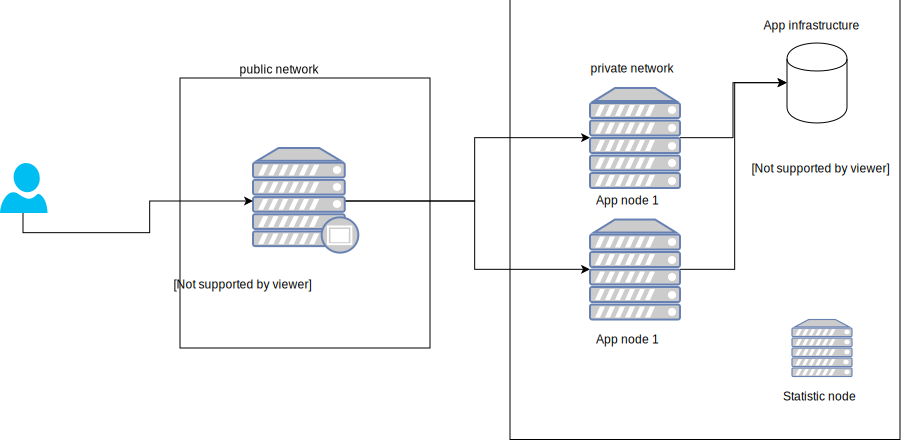

# Ansible environment installation

## Components

### Application

Application written in JAVA, HTTP integration with Spring Boot.
Systemd was used for app state management

### Loadbalancer

Nginx configured as a load balancer, allows to distribute traffic to multiple web nodes 

### Statistics

Telegraf, influxdb and grafana stack is responsible for gather, store and visualize technical and bussines metrics


## Ansible variables

```APP_ARTIFACT_URL``` application artifact url

```APP_NODE_IPS``` list of private ``ip:port`` pairs responsible for handling http requests proxied via LB

## Convention

```
repository: github.com/acme/{serviceName}.git
artifactId: target/{serviceName}.jar
applicationHome: /opt/{serviceName}
logs: /var/logs/{serviceName}/service.log
systemd: /etc/systemd/system/{serviceName}.conf
systemd service {serviceName}
```

```bash
journalctl -u -f {serviceName}
```


## Diagram

